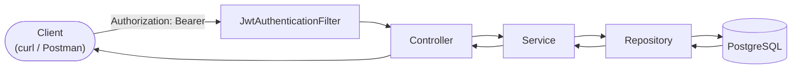
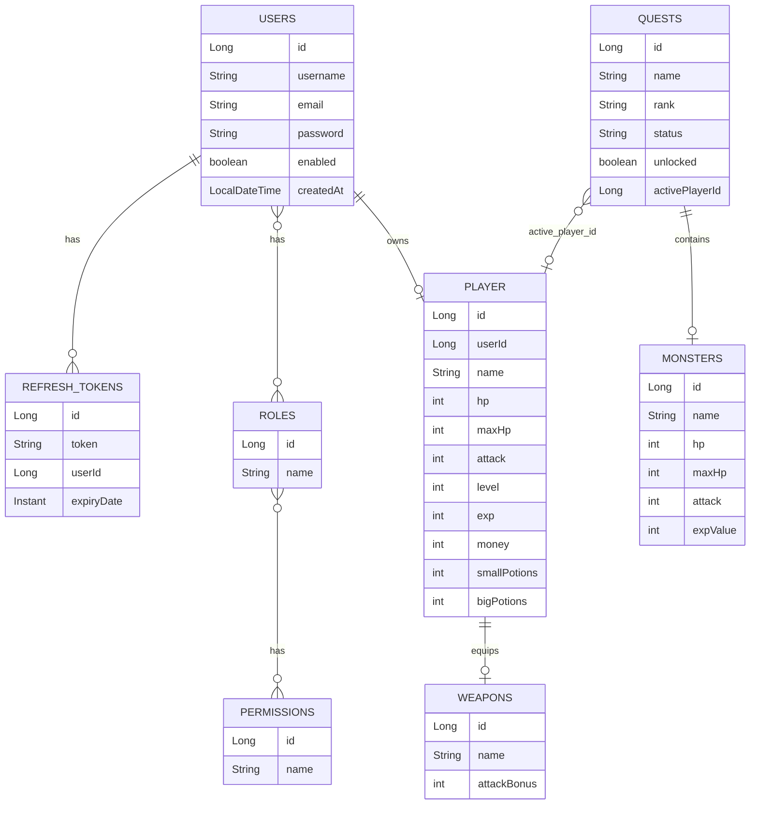
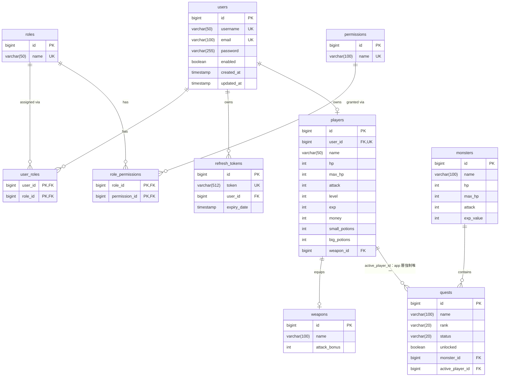
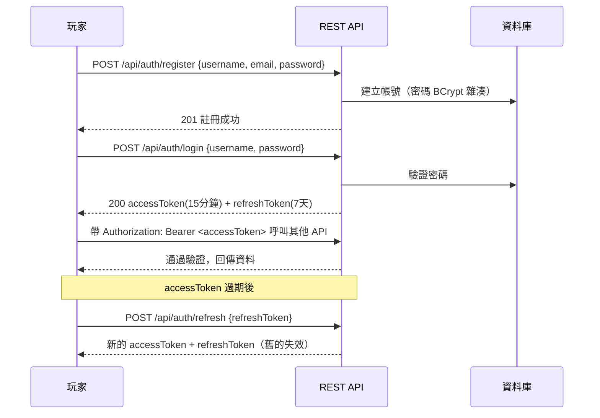
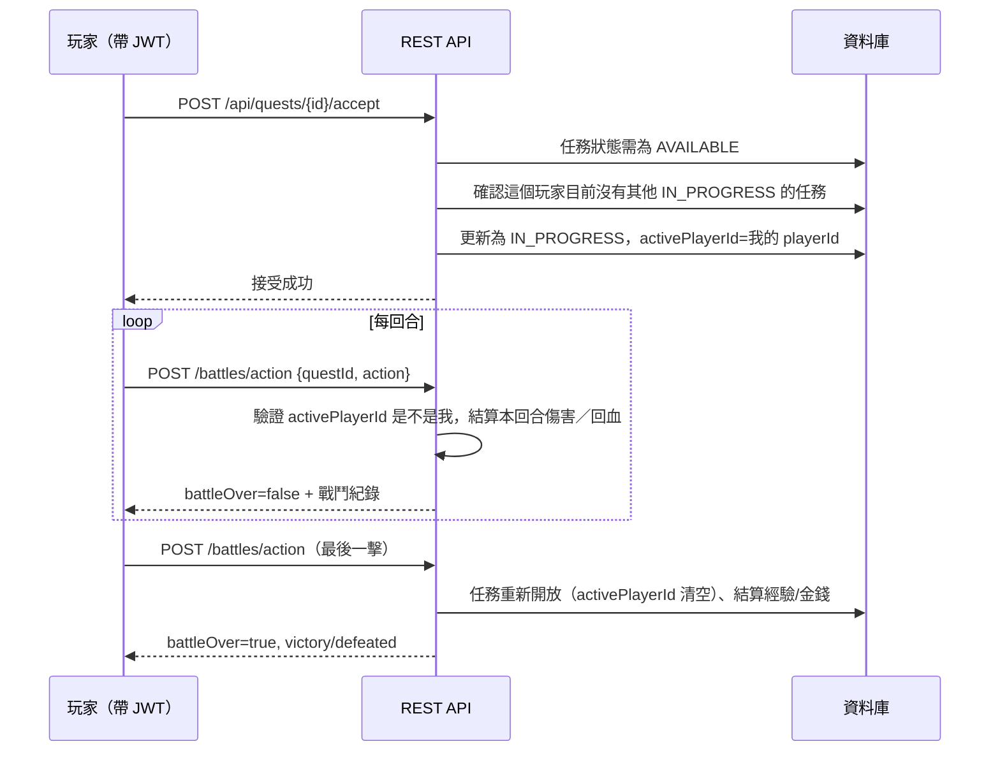

# MonsterHunter

一個用 **Spring Boot 4 + Spring Security + JWT + Spring Data JPA** 寫的文字版狩獵 RPG 後端。註冊帳號、登入拿 JWT、建立自己的獵人角色，接任務、跟魔物回合制戰鬥、逛商店買藥水／強化武器。所有遊戲操作都綁在登入帳號自己的獵人身上，不能用別人的角色，也不會有兩個玩家同時打同一隻魔物互相干擾血量的問題；同一個獵人同一時間也只能專心進行一個任務，沒完成或離開前不能再接新的。

技術棧：**Java 24 · Spring Boot 4.0.6 · Spring Security 7 · PostgreSQL · Flyway · jjwt · Lombok**

## 系統架構



## 資料模型



`QUESTS.active_player_id` 是雙向鎖：一個任務同時只能有一個 `active_player_id`（一隻魔物不能被兩個人同時打），反過來，同一個 `playerId` 也只能同時是一個任務的 `active_player_id`（一個獵人不能同時進行多個任務）。目前這條規則只在 Service 層檢查（`QuestService.acceptQuest`），資料庫沒有對應的 unique constraint。

## 資料庫設計

上面的資料模型是概念層次的抽象（多對多關聯直接畫一條線，不特別畫出中間表）。這張圖是實際落在 PostgreSQL 裡的實體表結構，跟 `db/migration` 底下的 SQL 一一對應，包含中間表本身，並標出每個欄位的 PK／FK／UK。



幾個實際的設計取捨：

- **中間表是物理層才有的東西**：`user_roles`、`role_permissions` 在上面的資料模型圖被簡化成一條多對多的線，實際上是兩張獨立的表，各自用兩個 FK 疊起來當複合主鍵。
- **`players.user_id` 是 FK 也是 UK**：靠資料庫層級的 unique constraint 保證「一個帳號只能有一隻獵人」，這條規則是 DB 真正擋住的。
- **`quests.active_player_id` 允許 NULL，也沒有 unique constraint**：嚴格照 schema 來看，它其實是「多個任務可以指到同一個 active_player_id」的多對一關係；「一個玩家同時只能進行一個任務」完全是 `QuestService` 用程式碼擋的，資料庫本身不會阻止你插入違反這條規則的資料——跟 `players.user_id` 那條形成對比：同樣是「唯一性規則」，一個做在 DB 層、一個做在程式碼層。
- **`users.updated_at` 目前是死欄位**：migration 裡有建這個欄位，但 `User` entity 沒有對應的 Java 欄位，也沒有 `@PreUpdate` 邏輯，所以它只會在建立帳號那一刻寫入一次，之後永遠不會被更新。

## 專案結構

```
src/main/java/com/example/monsterhunter/
├── entity/          User, Role, Permission, RefreshToken（帳號） + Player, Weapon, Monster, Quest（遊戲）
├── entity/enums/     QuestRank, QuestStatus
├── security/        JwtUtils, JwtAuthenticationFilter, UserPrincipal, UserDetailsServiceImpl
├── config/          SecurityConfig（API 權限規則）
├── repository/      Spring Data JPA repositories
├── service/         RefreshTokenService（認證） + PlayerService, QuestService, BattleService, StoreService（遊戲）
├── controller/      AuthController（認證） + PlayerController, QuestController, BattleController, StoreController（遊戲）
├── dto/             API 請求/回應物件
└── exception/       自訂例外 + 全域錯誤處理

src/main/resources/
├── application.yaml
└── db/migration/
    ├── V1__auth_schema.sql        帳號 / 角色 / 權限 / refresh token
    └── V2__create_game_schema.sql 玩家 / 武器 / 魔物 / 任務 + 任務板種子資料
```

## 如何執行

需要 **Java 24**，以及一個能連到的 **PostgreSQL** 跟 **Redis**——想全部用 Docker 一次起來看選項 D，不想動 Docker 的話看選項 A/B/C（但那三個沒有 Redis，`@Cacheable` 那些功能會在啟動時就因為連不到 Redis 而失敗，要嘛額外自己起一個 Redis，要嘛只想跑其他功能可以先把 `CacheConfig`/`@Cacheable` 拿掉）。

### 選項 D：Docker Compose 一鍵起（app + postgres + redis，最推薦）

```bash
cp .env.example .env
# 打開 .env，把 DB_PASSWORD、JWT_SECRET 換成自己的值

docker compose up -d --build
```

看 log 確認三個服務都起來：

```bash
docker compose logs -f app
```

看到 `Started MonsterHunterApplication` 就是成功了，服務在 `http://localhost:8080`。

**驗證真的是「一鍵」、不是本機殘留狀態撐起來的**：

```bash
docker compose down -v   # 連 postgres 的 volume 一起清掉，模擬全新機器
docker compose up -d --build
```

一樣要能正常起來（Flyway 會重新建表 + 種子資料）才算數。

不用的時候 `docker compose down`（不加 `-v`）會保留 `postgres_data` volume，資料不會不見；`-v` 才會連資料一起清掉。

### 選項 A：本機已安裝 PostgreSQL（預設抓 `localhost:5432`）

```bash
# 先建立資料庫
psql -U postgres -c "CREATE DATABASE monsterhunter_db;"

# 密碼一定要用環境變數帶入，不要寫進任何檔案
export DB_PASSWORD=你的PostgreSQL密碼
./mvnw spring-boot:run
```

### 選項 B：用 Docker 起一個 PostgreSQL（不想動本機環境的話）

```bash
docker run -d --name my_postgres \
  -e POSTGRES_PASSWORD=my_secret_password \
  -p 5433:5432 postgres:15

docker exec my_postgres psql -U postgres -c "CREATE DATABASE monsterhunter_db;"

export DB_URL=jdbc:postgresql://localhost:5433/monsterhunter_db
export DB_USERNAME=postgres
export DB_PASSWORD=my_secret_password
./mvnw spring-boot:run
```

用 5433 而不是 5432，是為了不跟本機可能已經在跑的 PostgreSQL 搶 port，兩者可以同時並存。

### 選項 C：用 IntelliJ IDEA 執行（不是在終端機跑）

`export` 設的環境變數只有終端機那個 session 看得到，IntelliJ 不會自動繼承，要另外設定：

1. 右上角執行按鈕旁邊的下拉選單 → **Edit Configurations...**
2. 沒有設定過的話點 **Add new...** → 選 **Spring Boot**，Main class 選 `com.example.monsterhunter.MonsterHunterApplication`
3. **Store as project file** 保持不勾選——這個專案的 `.gitignore` 沒有排除 `.run/` 資料夾，勾了的話環境變數（包含密碼）會存進一個可能被 git 追蹤的檔案
4. **Environment variables** 欄位打（分號分隔，格式是 `VAR=value;VAR2=value2`）：
   ```
   DB_PASSWORD=你的PostgreSQL密碼;JWT_SECRET=你自己生成的一組亂數字串
   ```
5. Apply → OK

**之後執行務必用這個存好的設定**（工具列下拉選單選到 `MonsterHunterApplication` 再點 Run），**不要**點程式碼裡 `main()` 旁邊那個綠色箭頭——那個箭頭每次都是用一個獨立的「臨時設定」跑，不會帶入你剛剛設定的環境變數，會得到一樣的啟動失敗。

看到 `Started MonsterHunterApplication` 就成功了。Flyway 會自動照 `V1`、`V2` 建好所有表，並種好 9 個任務（1★/2★/3★ 各 3 隻魔物）。

其他可覆蓋的環境變數：

| 環境變數 | 預設值 | 用途 |
|---|---|---|
| `DB_URL` | `jdbc:postgresql://localhost:5432/monsterhunter_db` | 資料庫連線位址 |
| `DB_USERNAME` | `postgres` | 資料庫帳號 |
| `DB_PASSWORD` | 無，必填 | 資料庫密碼 |
| `JWT_SECRET` | 無，必填 | JWT 簽章密鑰，本機開發自己隨便打一組夠長（≥32 bytes）的亂數字串即可 |
| `REDIS_HOST` | `localhost` | Redis 位址，任務板快取用 |
| `REDIS_PORT` | `6379` | Redis port |
| `SERVER_PORT` | `8080` | 服務監聽 port |

`DB_PASSWORD`、`JWT_SECRET` 這兩個沒有預設值，不設定就直接啟動失敗——是刻意設計成這樣，避免有人不小心把正式環境的密碼／密鑰寫死進這份設定檔（見上面「資料庫設計」段落的類似討論）。

## 認證流程



## API 一覽

| 功能 | 需要登入 | Method | Path |
|---|---|---|---|
| 註冊 | 否 | POST | `/api/auth/register` `{"username","email","password"}` |
| 登入 | 否 | POST | `/api/auth/login` `{"username","password"}` |
| 換新 token | 否（要帶 refreshToken） | POST | `/api/auth/refresh` `{"refreshToken"}` |
| 登出 | 否（要帶 refreshToken） | POST | `/api/auth/logout` `{"refreshToken"}` |
| 建立我的獵人 | 是 | POST | `/api/players/me` `{"name":"獵人名稱"}` |
| 查我的獵人狀態 | 是 | GET | `/api/players/me` |
| 任務板 | 否 | GET | `/api/quests` |
| 任務詳情 | 否 | GET | `/api/quests/{id}` |
| 接任務 | 是 | POST | `/api/quests/{id}/accept` |
| 戰鬥（一次呼叫 = 一回合，重複呼叫直到 battleOver=true） | 是 | POST | `/api/battles/action` `{"questId":1,"action":"ATTACK"}` |
| 商店買藥水 | 是 | POST | `/api/store/potion?type=SMALL` 或 `BIG` |
| 商店強化武器 | 是 | POST | `/api/store/upgrade-weapon` |
| 管理端：查看所有玩家的獵人 | 是（需 `ROLE_ADMIN`） | GET | `/api/admin/players` |

`action` 可用值：`ATTACK`（攻擊）、`SMALL_POTION`（喝小藥水）、`BIG_POTION`（喝大藥水）、`LEAVE`（離開戰鬥）。

`/api/admin/**` 這組路徑除了要登入，帳號還要有 `ROLE_ADMIN` 角色，一般使用者（`ROLE_USER`）呼叫會拿到 403，不是 401 也不是 500。

需要登入的端點都要在 header 帶 `Authorization: Bearer <accessToken>`；玩家身分完全從 token 解出來，request 裡不用也不能指定要操作誰的角色。

## Redis 快取

`GET /api/quests`（任務板）快取在 Redis，key 是 `questBoard::SimpleKey []`，存的是 `QuestResponse`（DTO）序列化成的 JSON，不是 Quest entity。任何會改到任務狀態的動作（接任務、戰鬥結束的離開/勝利/落敗）都會清掉這個快取，確保任務板不會顯示過期狀態。

怎麼demo「真的有接上」：

```bash
# 開著 show-sql，連續打兩次
curl http://localhost:8080/api/quests
curl http://localhost:8080/api/quests
```

第一次呼叫後端 log 會看到查 quests/monsters 的 SQL；第二次呼叫應該完全沒有新的 SQL 出現，直接從 Redis 回。也可以直接用 `redis-cli` 看快取內容（key 名稱由 Spring 自動產生，先 `KEYS` 查出實際的名字再 `GET`）：

```bash
docker compose exec redis redis-cli KEYS '*'
# 上面指令印出來的 key 原封不動貼到下面
docker compose exec redis redis-cli GET '<上面查到的 key>'
```

接一個任務或打完一場戰鬥之後，這個 key 應該會消失（被 `@CacheEvict` 清掉），下一次 `GET /api/quests` 會重新查 DB、重新建快取。

## 任務戰鬥流程

一個任務同時間只能被一個玩家進行，接任務時會把玩家的 `playerId` 記在任務的 `activePlayerId` 上，戰鬥結束（勝利/失敗/離開）前，其他玩家不能接同一個任務，也不能對它發動戰鬥動作。反過來，接任務前也會檢查這個玩家是不是已經有其他 `IN_PROGRESS` 的任務——有的話會被擋下來，必須先完成或離開手上那個任務，才能接下一個，避免一個人同時掛著好幾隻魔物不打、卡住其他玩家。



## 如何遊玩（API 呼叫範例）

沒有做前端畫面，遊玩方式是依序呼叫上面的 API（curl、Postman、APIfox 都可以）：

**1. 註冊 + 登入**
```bash
curl -X POST http://localhost:8080/api/auth/register -H "Content-Type: application/json" \
  -d "{\"username\":\"hunter1\",\"email\":\"hunter1@example.com\",\"password\":\"password123\"}"

curl -X POST http://localhost:8080/api/auth/login -H "Content-Type: application/json" \
  -d "{\"username\":\"hunter1\",\"password\":\"password123\"}"
```
把回傳的 `accessToken` 記下來，之後的呼叫都要帶（以下用 `<TOKEN>` 表示）。

**2. 建立獵人**
```bash
curl -X POST http://localhost:8080/api/players/me -H "Authorization: Bearer <TOKEN>" \
  -H "Content-Type: application/json" -d "{\"name\":\"小明\"}"
```

**3. 看任務板**
```bash
curl http://localhost:8080/api/quests
```
記下想打的任務 `"id"`（以下範例假設是 1）。

**4. 接任務**
```bash
curl -X POST http://localhost:8080/api/quests/1/accept -H "Authorization: Bearer <TOKEN>"
```

**5. 戰鬥（重複呼叫，一次等於一回合）**
```bash
curl -X POST http://localhost:8080/api/battles/action -H "Authorization: Bearer <TOKEN>" \
  -H "Content-Type: application/json" -d "{\"questId\":1,\"action\":\"ATTACK\"}"
```
`action` 可換成 `"SMALL_POTION"`、`"BIG_POTION"`、`"LEAVE"`。`battleOver=true` 代表這輪戰鬥結束。

**6. 逛商店**
```bash
curl -X POST "http://localhost:8080/api/store/potion?type=SMALL" -H "Authorization: Bearer <TOKEN>"
curl -X POST http://localhost:8080/api/store/upgrade-weapon -H "Authorization: Bearer <TOKEN>"
```

**7. 查角色狀態**
```bash
curl http://localhost:8080/api/players/me -H "Authorization: Bearer <TOKEN>"
```

## 怎麼弄一個 ADMIN 帳號

註冊 API 一律只給 `ROLE_USER`，`ROLE_ADMIN` 要手動綁定，不會有人能透過 API 自己把自己升級成管理員：

```bash
# 1. 先照正常流程註冊一個帳號
curl -X POST http://localhost:8080/api/auth/register -H "Content-Type: application/json" \
  -d "{\"username\":\"你的帳號\",\"email\":\"你的信箱\",\"password\":\"你的密碼\"}"

# 2. 進資料庫把 ROLE_ADMIN 綁給它（psql 或 DataGrip 都可以）
INSERT INTO user_roles (user_id, role_id)
SELECT u.id, r.id FROM users u, roles r
WHERE u.username = '你的帳號' AND r.name = 'ROLE_ADMIN';
```

綁完要**重新登入**拿新的 token（角色是寫進 JWT 裡的，舊 token 不會自動更新）。之後帶新 token 打 `/api/admin/players` 就能看到所有玩家的獵人角色列表。

## 遊戲數值規則

- 獵人：初始 HP 100、攻擊 10、金錢 500、大藥水 3 瓶，配備「初階獵刀」(+5 攻擊)。
- 升級：exp 每滿 100 升 1 級，攻擊 +5、HP 回滿。
- 戰鬥：攻擊造成「基礎攻擊+武器加成」的傷害；喝藥水本回合不能攻擊，但魔物的反擊傷害減半。
- 狩獵成功：任務重新開放、魔物血量重生、玩家獲得 50 exp、150 金錢，並回復目前損血量的 50%。
- 狩獵失敗（HP 歸零）：任務重新開放、HP 回復至 30。
- 商店：小藥水 $100、大藥水 $200、強化武器 $500（每次攻擊 +15，名稱疊加 `(+1)`、`(+2)`...）。

## 安全性設計

- 密碼一律 BCrypt 雜湊儲存，資料庫密碼與 JWT 簽章密鑰都透過環境變數帶入，不寫死在程式碼或設定檔裡（見上方「如何執行」的環境變數表）。
- 除了註冊/登入/任務瀏覽，其餘 API 一律要求 JWT 驗證（`SecurityConfig` 預設 `anyRequest().authenticated()`）。
- 遊戲角色操作（建立獵人、接任務、戰鬥、商店）都是從登入的 JWT 反解出 `userId` 找到對應的獵人，request 裡不接受呼叫端指定要操作哪個玩家 id，避免冒用他人角色。
- 任務用 `activePlayerId` 鎖定進行中的獵人，避免兩個帳號同時對同一隻魔物發動戰鬥、血量互相干擾。
- 角色分級：一般帳號是 `ROLE_USER`，只能操作自己的獵人；`/api/admin/**` 底下的管理端點要求 `ROLE_ADMIN`，沒有這個角色一律 403（見上方「怎麼弄一個 ADMIN 帳號」）。
